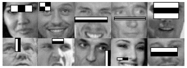

# Implementation of the Viola-Jones Face Detection Algorithm

This repository contains an implementation of the Viola-Jones algorithm for face detection.

The implementation includes the use of haar filter, integral images and the ADA Boost algorithm. However, the implementation of the attentional cascade was never completed.

The figure below displays some of the haar filters learned by a trained model. The training dataset used in this model was obtained from the Computer Vision course of the University of Washington.

